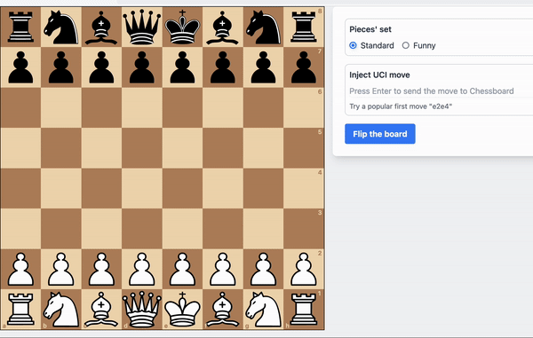

## Overview

`dioxus-chessboard` is a Rust crate designed to provide a web-based chessboard component
for the Dioxus framework. This crate offers an interactive and customizable chessboard
that can be integrated into any web application built with Dioxus.

<p align="center">
  
</p>

## Setup

- Install the latest Dioxus CLI

  ```bash
  cargo install --git https://github.com/DioxusLabs/dioxus dioxus-cli
  ```

- Install the latest Tailwind CLI

  ``` bash
  npm install -g tailwindcss @tailwindcss/cli 
  ```

- Clone this repository
  ```bash
  git clone git@github.com:vnermolaev/dioxus-chessboard.git
  ```   

- Compile the styles
  ``` bash
  npx tailwindcss -i ./input.css -o ./public/tailwind.css --watch
  ```

- Compile the showcase example
  ``` bash
  dx serve --example=showcase --features showcase --hot-reload=true
  ```

- Navigate to [localhost](http://127.0.0.1:8080)

## Credit

All images are in Public Domain and sourced from [OpenClipart](https://openclipart.org/).